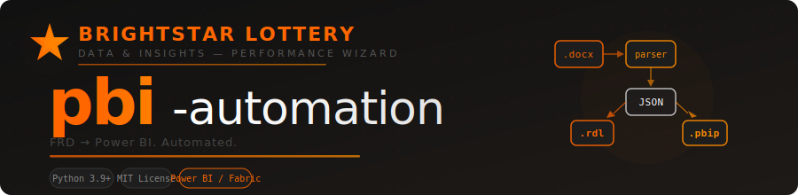
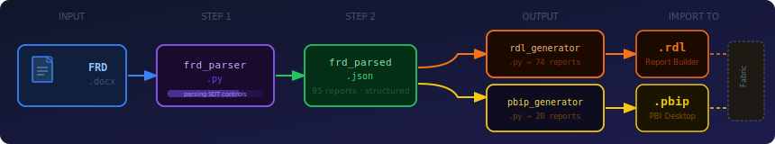

<div align="center">



<br/>

[](https://www.python.org/)
[](LICENSE)
[](https://app.powerbi.com)
[](#output-file-formats)
[](#frd-format-requirements)

**Turn a Functional Requirements Document into Power BI report files in seconds — not days.**

[Quick Start](#quick-start) · [Pipeline](#pipeline) · [Output Formats](#output-file-formats) · [Extending](#extending-the-tool) · [Troubleshooting](#troubleshooting)

</div>

---

## Why pbi-automation?

A typical FRD describes Power BI reports with various attributes: layouts, parameters, filters, requirements. Translating each one manually into `.rdl` XML or `.pbip` JSON takes developers hours per report.

**pbi-automation parses the FRD once and generates all report scaffolding automatically** — correct RDL structure, proper semantic model bindings, page-per-section PBIP layouts, and per-report developer checklists. Developers start from a working skeleton instead of a blank canvas.

---

## Pipeline

<div align="center">

</div>

---

## Prerequisites

- **Python 3.9+**
- **pip**
- Your FRD as a `.docx` file (ADO / Performance Wizard format)

### Windows

Fully supported. Run in **Windows Terminal** or **PowerShell** for correct Unicode block-art rendering. CLI colours are automatically disabled on Windows — output is plain text but fully functional.

---

## Quick Start

**1. Clone and install**

```bash
git clone https://github.com/avi-igt/pbi-automation.git
cd pbi-automation
pip install -r requirements.txt
```

**2. Add your FRD**

Copy your FRD `.docx` into the repo root:

```
pbi-automation/
  Your FRD v1.0.docx     ← place it here
  generate_all.py
  src/
```

**3. Run**

```bash
python generate_all.py "Your FRD v1.0.docx"
```

That's it. All report files land in `output/`.

---

## Usage

### Full pipeline

```bash
# Default — looks for the FRD in the current directory
python generate_all.py

# Explicit FRD path
python generate_all.py "path/to/FRD.docx"

# Custom output directory
python generate_all.py "path/to/FRD.docx" -o ./my-output
```

### Filter to a single report

```bash
python generate_all.py --report "Cash Pop"
python generate_all.py --report "Keno"
python generate_all.py --report "Invoice"
```

### Run one step at a time

```bash
python generate_all.py --only parse   # Step 1 only: FRD → JSON
python generate_all.py --only rdl     # Step 2 only: JSON → .rdl (requires prior parse)
python generate_all.py --only pbip    # Step 3 only: JSON → .pbip (requires prior parse)
```

### Run modules directly

```bash
python -m src.frd_parser   "FRD.docx"              -o output/json/frd_parsed.json
python -m src.rdl_generator  output/json/frd_parsed.json  -o output/rdl
python -m src.pbip_generator output/json/frd_parsed.json  -o output/pbip
```

---

## Output File Formats

### Paginated Reports — `.rdl`

```
output/rdl/
  Reports_Brightstar/
    Active_Keno_Retailers_Report.rdl
    Brightstar_Invoice_Report.rdl
    ...
  Reports_Lottery_Sales/
    Daily_Sales_Summary.rdl
    ...
```

Each generated `.rdl` includes:

| Element | What's generated |
|---|---|
| XML schema | Correct 2016 RDL with `<ReportSections>` wrapper + all namespaces |
| Data source | `PBIDATASET` (semantic model) or `ODBC` (DB2 / Snowflake) |
| Dataset query | DAX `EVALUATE SUMMARIZECOLUMNS(...)` stub or SQL stub |
| Parameters | `<ReportParameter>` + `<QueryParameter>` linkage |
| Tablix | Header row + data row for every layout column |
| Page header | Report name + run date/time |
| Page footer | Report name + page X of Y |
| Comments | All FRD requirement IDs embedded as XML comments |

**Developer steps after generation:**
1. Update `<ConnectString>` with your Fabric workspace + dataset GUID
2. Replace `TODO_Table[ColumnName]` with real semantic model field names (or real SQL for DB2)
3. Open in Power BI Report Builder and validate

### Visual Reports — `.pbip`

```
output/pbip/
  Reports_Brightstar/
    Cash_Pop_Performance.pbip
    Cash_Pop_Performance.Report/
      definition.pbir          ← semantic model binding
      definition/
        report.json            ← theme & settings
        version.json
        pages/
          pages.json           ← page order
          ReportSection1/      ← one per FRD layout section
            page.json
            visuals/
              {id}/visual.json ← title, slicers, data visual
          ReportSection2/
            ...
      README.md                ← developer TODO checklist
```

Each generated `.pbip` includes:

| Element | What's generated |
|---|---|
| `definition.pbir` | `byPath` binding to the best-matched `MO_*.SemanticModel` |
| Pages | One page per layout section from the FRD |
| Visual type | Inferred from section/column names: table, bar, line, pie, or card |
| Slicers | One slicer per filter defined in the FRD |
| Title textbox | Auto-populated from the section display name |
| `README.md` | Full requirements list + step-by-step checklist per report |

**Developer steps after generation:**
1. Verify `definition.pbir` `byPath` points to the correct `.SemanticModel`
2. In each `visual.json`, replace `TODO_Table` with the actual entity name
3. Open the `.pbip` in Power BI Desktop (Fabric) and validate

---

## Semantic Model Mapping

The tool auto-selects the best-fit `MO_*` semantic model based on report name and description:

| Semantic Model | Keywords matched |
|---|---|
| `MO_Sales` | sales, retailer, wager, ticket, revenue |
| `MO_Inventory` | inventory, pack, activated, aging, bin, scratchers |
| `MO_Payments` | payment, check, 1042, tax, claim |
| `MO_DrawData` | draw, jackpot, winning number, cash pop, keno |
| `MO_WinnerData` | winner, prize |
| `MO_Promotions` | promotion, promo, cashless |
| `MO_Invoice` | invoice, brightstar |
| `MO_IntervalSales` | interval, hourly |
| `MO_CoreTables` | retailer list, chain store, district, terminal, device |
| `MO_LVMSales` | lvm, vending machine |

Override per-report by editing `definition.pbir` (visual) or the `<ConnectString>` (paginated).

---

## FRD Format Requirements

This tool is designed for FRDs in the **Performance Wizard / Azure DevOps** format:

- Reports are **Heading 2** sections under folder **Heading 1** sections
- Each section contains **ADO SDT content controls** (Work Item type) with sub-sections:

| Sub-section | Content |
|---|---|
| `Summary` | Report title, format (Paginated/Visual), folder, legacy info |
| `Parameters` | Label · Single/Multiple · Notes |
| `Filters` | Label · Type (Global/Page/Local) · Context · Single/Multiple |
| `Layout` | Column names, optionally split by `<Tab N>`, `<Page N>`, `<Table N>` markers |
| `Requirements` | ADO work item IDs + requirement text |

Reports with `Report Format` = `Paginated` / `.rdl` → generate `.rdl`  
Reports with `Report Format` = `Visual` / `Power BI` / `.pbip` → generate `.pbip`

---

## Project Structure

```
pbi-automation/
  generate_all.py          ← pipeline entry point (run this)
  requirements.txt
  assets/
    banner.svg             ← project banner
    pipeline.svg           ← pipeline diagram
  src/
    frd_parser.py          ← .docx → structured JSON
    rdl_generator.py       ← JSON → .rdl XML (paginated)
    pbip_generator.py      ← JSON → .pbip folder (visual)
  output/                  ← generated files (not committed)
    json/frd_parsed.json
    rdl/
    pbip/
```

---

## Extending the Tool

### Support a new FRD field

Edit `src/frd_parser.py` → `parse_summary()`: add the new field name to the `fields` list.

### Support a new datasource

Edit `src/rdl_generator.py` → `generate_rdl()`: add a branch alongside `semantic_model` / `db2` with the correct `<DataProvider>` and `<ConnectString>`.

### Add a new visual type

Edit `src/pbip_generator.py`:
1. Add keywords to `_CHART_HINTS`
2. Add a `make_*_visual()` function following the same pattern
3. Call it from `build_page_visuals()`

---

## Troubleshooting

**`ModuleNotFoundError: No module named 'docx'`**  
The package name is `python-docx`, not `docx`: `pip install python-docx`

**Reports show `"report_format": "Unknown"` in JSON**  
The `Report Format` field in the FRD summary is blank or non-standard. Find the entry in `output/json/frd_parsed.json` and check the source FRD section.

**Columns appear as one long string**  
Word has no spaces between column names. The parser splits on camelCase boundaries. For all-uppercase or unusual separators, inspect the `raw` field in JSON and adjust `_split_columns()` in `frd_parser.py`.

**Wrong semantic model selected**  
Edit `definition.pbir` manually, or add report-specific keywords to `_infer_semantic_model()` in `pbip_generator.py`.

---

<div align="center">

★ Built by the **Brightstar Lottery** Performance Wizard team.

[](https://github.com/avi-igt/pbi-automation)
[](LICENSE)

</div>
